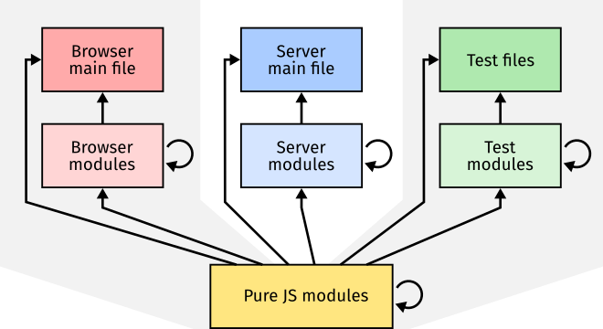

# Computing-2-Notes

Javascript files in web apps come in a number of varieties.
Some files are run directly and immediately take actions – these are *main* files;
whilst other files export functionality rather than acting themselves – these are *modules* – and can be imported from main files or other modules.

Javascript files can be made to run in different *runtime environments*, e.g. on a web browser, a web server, or a test framework.
Some javascript files will only make use of the core javascript language features, these are pure javascript files, and can be run in any environment.
Others will make use of features from the interface the environment provides, such as altering the page layout on a web browser, or listening for a request on a web server.
The files that make use of these special features can only be run in the environment they were intended for – you can't run a browser file on the server.

It is important to recognise what kind of file you are looking at, knowing where it will be run, and how it will be called.
Your program might not even run if it tries to call functions from a differnent environment – e.g. there are no html elements on the server, nor functions to access them.
It also helps to structure your programs better if each file has it's own responsibilities.
Your style of coding may also be different depending on the type of file – pure javascript modules may be written in a functional programming style, while the main browser file is likely to be more imperative.

Let's review the types of javascript file you'll work with.

### Browser Main File ###
One of the most important files in a web app is your browser main file.
This is the file that is the entry point to your program on the web browser.
It starts up all the behaviour that you want your web app to have, i.e. constructing the document, setting up event listeners, communicating with a server.

There should be only one main file in each html page, by convention we will call this file `main.js` and we will load it in an html page, i.e. `index.html`, with the following code:
```html
<script type="module" src="main.js"></script>
```
The main browser file can import any number of browser modules and pure javascript modules.
As a file running on a browser, it also has access to all the [Web APIs](https://developer.mozilla.org/en-US/docs/Web/API), e.g. [`document`](https://developer.mozilla.org/en-US/docs/Web/API/Document) to access the *Document Object Model (DOM)* which manpulates browser UI elements in the page, and [`fetch`](https://developer.mozilla.org/en-US/docs/Web/API/Fetch_API) which faciltates *ajax* requests.

### Server Main File ###


### Modules ###
Modules are files that don't run in their own right, but export functionality that other javascript files can import and make use of.
A module can be imported from any other javascript file using the `import` statement, i.e.,
```javascript
import Module from "./module.js";
```
Then the file that is importing the module has access to the `Module` object and all the properties on it.
Module files themselves are defined by creating an object to export, adding properties to it, and then using the `export` keyword to export that object.
```javascript
const Module = Object.create(null);

Module.property = ... // Add functionality to the exported module object.

export default Object.freeze(Module);
```


|  |
|---|
| **Types of Javascript files:** Main files and modules running on the browser, server, and test framework. Arrows show which types of file can import other types, e.g. a browser main file can import a pure javascript module, and a server module can import another server module.|


```bash
node server.js
```
