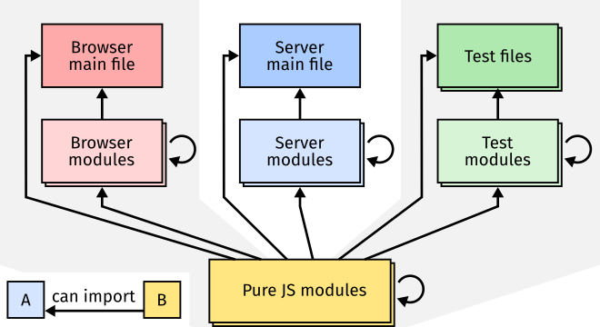
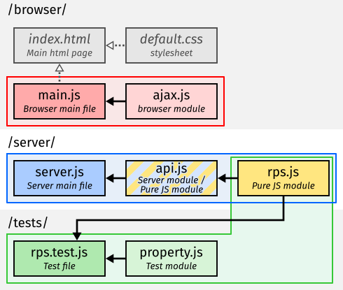

# The Structure of a Web App
## Javascript Files

Javascript files in web apps come in a number of varieties.
Some files are run directly and immediately take actions – these are *main* files;
whilst other files export functionality rather than acting themselves – these are *modules* – and can be imported from main files or other modules.

Javascript files can be made to run in different *runtime environments*, e.g. on a web browser, a web server, or a test framework.
Some javascript files will only make use of the core javascript language features, these are pure javascript files, and can be run in any environment.
Others will make use of features from the interface the environment provides, such as altering the page layout on a web browser, or listening for a request on a web server.
The files that make use of these special features can only be run in the environment they were intended for – you can't run a browser file on the server.

It is important to recognise what kind of file you are looking at, knowing where it will be run, and how it will be called.
Your program might not even run if it tries to call functions from a differnent environment – e.g. there are no html elements on the server, nor functions to access them.
It also helps to structure your programs better if each file has it's own responsibilities.
Your style of coding may also be different depending on the type of file – pure javascript modules may be written in a functional programming style, while the main browser file is likely to be more imperative.

Let's review the types of javascript file you'll work with.
|  |
|---|
| **Types of javascript files:** Main files and modules running on the browser, server, and test framework. Arrows show which types of file can import other types, e.g. a browser main file can import a pure javascript module, and a server module can import another server module.|


### Browser Main File ###
One of the most important files in a web app is your browser main file.
This is the file that is the entry point to your program on the web browser.
It starts up all the behaviour that you want your web app to have, i.e. constructing the document, setting up event listeners, communicating with a server.

There should be only one main file in each html page, by convention we will call this file `main.js` and we will load it in an html page, i.e. `index.html`, with the following code:
```html
<script type="module" src="main.js"></script>
```
The main browser file can import any number of browser modules and pure javascript modules.
As a file running on a browser, it also has access to all the [Web APIs](https://developer.mozilla.org/en-US/docs/Web/API), e.g. [`document`](https://developer.mozilla.org/en-US/docs/Web/API/Document) to access the *Document Object Model (DOM)* which manpulates browser UI elements in the page, and [`fetch`](https://developer.mozilla.org/en-US/docs/Web/API/Fetch_API) which faciltates *ajax* requests.

### Server Main File ###
The server main file is the entry point to the main program that is run by node.js.
In our context, this file will have two responsibilities:
the first is to statically serve the browser program to web browsers that request it;
and second to handle any *ajax* requests that instances of the browser program make to the server.
Within that remit, the server may access other resources such as external APIs, databases, file system, connected equipment, coordination with multiple browser instances, etc.

The server specific APIs that are available here are [what is provided by node](https://nodejs.org/docs/latest/api/) as well as any packages installed with *npm*, such as [express](https://expressjs.com/).

We will use the convention of calling the server main file `server.js`.
This file can be run directly by the node.js runtime,
```bash
node server.js
```
However, you are more frequently going to run it from *vscode* as a launch configuration in `launch.json`.

A historical context to be aware of; node.js has supported modules for longer than they have been part of the javascript standard when they were introduced in ES6.
That original system is called *CommonJS* modules, and you may see javascript files with a `.cjs` extension.
Node 14.0 introduced support for the newer ES6 modules, which is the same system used in the web browser, and what we will make exclusive use of.
For node to recognise `.js` files as using the ES6 module system, we need to explicitly turn this on by adding a `"type": "module"` property to the `launch.json` file in the web-app root directory.
If you see code using the `require` function, e.g. `const express = require("express");`, this is using CommonJS modules;
you may be able to swap this out for the ES6 `import` statement, `import express from "express";`.

### Modules ###
Modules are files that don't run in their own right, but export functionality that other javascript files can import and make use of.
A module can be imported from any other javascript file using the `import` statement, i.e.,
```javascript
import Module from "./module.js";
```
Then the file that is importing the module has access to the `Module` object and all the properties on it.
Module files themselves are defined by creating an object to export, adding properties to it, and then using the `export` keyword to export that object.
```javascript
const Module = Object.create(null);

Module.property = ... // Add functionality to the exported module object.

export default Object.freeze(Module);
```

Modules have *module scope*, which means that all variables declared within a module file are only accessible within that file.
This is a good thing, it means code written in one file doesn't interfere with that in another, for example if they both use a variable `x` that gets re-assigned in one file.
Only values explicitly exported and imported are shared between files.

Modules can be written for the browser or the server, based on what environment features they call, or written in pure javascript to be imported anywhere.
Be aware that modules written for a particular environment can only be imported by files written for the same environment,
i.e. a browser module can only be imported into other browser modules or main files.
In practice, there's nothing stopping you to import a browser module into a server file, but your program will raise an error when it tries to access a feature that isn't availible to it in the context.
A common error of this form is `Uncaught ReferenceError: document is not defined`.

Browser modules, server modules, and pure javascript modules can have may different purposes.
A browser module might define a helper function for making ajax calls, or be responsible for a particular UI interaction or animation.
A server module might give access to a database, or define an api.
Wheras pure javascript modules may be to play chess, represent complex numbers, or manipulate arrays.
It is best practice that each module has a single responsibility and has as narrrow scope as is feasable.

For example, a module that represents the states and rules of a game of chess should be independent of a module that displays that game in a browser.
The module that displays a game might import the module that knows the rules, or a main program might import both modules and be responsible for integrating them, but the chess rules module should be independent of how the game is displayed to the user so should not import any browser modules – chess has existed for much longer than web browsers.

### Test Files and Modules ###
In addition to browser and server files, there are also test files.
A test framework is another runtime environment for javascript files.
In practice, test files are often run by the node.js runtime, the same as on the server, but with additional features available.
We will use [Mocha](https://mochajs.org/) as our test framework, which provides the global functions `describe()` and `it()` which define a suite of tests that can be read by external tooling such as the *Test Explorer* in VSCode.
In principle, Mocha can also run in the browser runtime too, but we won't explore this further here.

Test files don't form part of the web-app itself, but sit alongside it.
Since tests are a different environmental context, they shouldn't import browser or server files.
This means it is the pure javascript modules that test files can import, and it is the functionality provided there that should be put under test.
Unit testing shouldn't be dependent on things outside the control of the programmer, such as users or the network, so it is a cleaner approach to ignore these things and test code in pure javascript that is used in the web app.

Each test file might focus on a javascript module and test features of it, we'll use the naming convention of a pure js module `module.js` will be imported into and tested by a test file `module.test.js`.
The test files are picked up by the testing framework.
In our case, a `.mocharc.json` file instructs us to look for files with the `.test.js` suffix in a `tests` folder.
Test files can also import test modules, these might themselves contain more tests, or [fast-check](https://github.com/dubzzz/fast-check) *arbitraries*, or other helper functions for testing.

### Example file structure ###
Let's see how each of these types of file fit together in a small web app example.
We'll look at the structure of a rock paper scissors, *rps*, game app that we'll return to in more detail throughout these notes.

|  |
|---|
| **Web app file structure example:** |

The figure shows the files that comprise the rock paper scissors web-app.
The files are organised into three directories, `/client/`, `/server/`, and `/tests/`.
