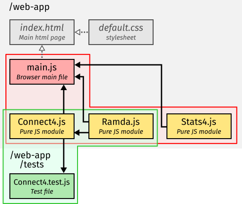

# The Structure of a Web App
## Javascript Files

Javascript files in web apps come in a number of varieties.
Some files are run directly and immediately take actions – these are *main* files;
whilst other files export functionality rather than acting themselves – these are *modules* – and can be imported from main files or other modules.

Javascript files can be made to run in different *runtime environments*, e.g. on a web browser, a web server, or a test framework.
Some javascript files will only make use of the core javascript language features, these are pure javascript files, and can be run in any environment.
Others will make use of features from the interface the environment provides, such as altering the page layout on a web browser, or listening for a request on a web server.
The files that make use of these special features can only be run in the environment they were intended for – you can't run a browser file on the server.

It is important to recognise what kind of file you are looking at, knowing where it will be run, and how it will be called.
Your program might not even run if it tries to call functions from a differnent environment – e.g. there are no html elements on the server, nor functions to access them.
It also helps to structure your programs better if each file has it's own responsibilities.
Your style of coding may also be different depending on the type of file – pure javascript modules may be written in a functional programming style, while the main browser file is likely to be more imperative.

Let's review the types of javascript file you might work with.

|  |
|---|
| **Types of javascript files:** Main files and modules running on the browser, server, and test framework. Arrows show which types of file can import other types, e.g. a browser main file can import a pure javascript module, and a server module can import another server module. |


### Browser Main File ###
One of the most important files in a web app is your browser main file.
This is the file that is the entry point to your program on the web browser.
It starts up all the behaviour that you want your web app to have, i.e. constructing the document, setting up event listeners, communicating with a server.

There should be only one main file in each html page, by convention we will call this file `main.js` and we will load it in an html page, i.e. `index.html`, with the following code:
```html
<script type="module" src="main.js"></script>
```
The main browser file can import any number of browser modules and pure javascript modules.
As a file running on a browser, it also has access to all the [Web APIs](https://developer.mozilla.org/en-US/docs/Web/API), e.g. [`document`](https://developer.mozilla.org/en-US/docs/Web/API/Document) to access the *Document Object Model (DOM)* which manpulates browser UI elements in the page.

### Modules ###
Modules are files that don't run in their own right, but export functionality that other javascript files can import and make use of.
A module can be imported from any other javascript file using the `import` statement, i.e.,
```javascript
import Module from "./module.js";
```
Then the file that is importing the module has access to the `Module` object and all the properties on it.
Module files themselves are defined by creating an object to export, adding properties to it, and then using the `export` keyword to export that object.
```javascript
const Module = Object.create(null);

Module.property = ... // Add functionality to the exported module object.

export default Object.freeze(Module);
```

Modules have *module scope*, which means that all variables declared within a module file are only accessible within that file.
This is a good thing, it means code written in one file doesn't interfere with that in another, for example both files can declare a variable with the same name without worrying that they will interfere with each other.
Only values explicitly exported and imported are shared between files.

Modules can be written for the browser or the server or a test framework, based on what environment features they call, or written in pure javascript to be imported anywhere.
Be aware that modules written for a particular environment can only be imported by files written for the same environment,
i.e. a browser module can only be imported into other browser modules or main files.
If you do import a module from one context into another, e.g. a browser file in a unit test, your program will raise an error when it tries to access a feature that isn't availible to it in the context.
A common error of this form is `Uncaught ReferenceError: document is not defined`.

Browser modules, server modules, and pure javascript modules can have may different purposes.
A browser module might be responsible for a particular UI interaction or animation.
A server module might give access to a database, or define an api.
Wheras pure javascript modules may be to play chess, represent complex numbers, or manipulate arrays.
It is best practice that each module has a single responsibility and has as narrrow scope as is feasable.

For example, a module that represents the states and rules of a game of chess should be independent of a module that displays that game in a browser.
The module that displays a game might import the module that knows the rules, or a main program might import both modules and be responsible for integrating them, but the chess rules module should be independent of how the game is displayed to the user so should not import any browser modules – chess has existed for much longer than web browsers.

### Test Files and Modules ###
In addition to browser and server files, there are also test files.
A test framework is another runtime environment for javascript files.
In practice, test files are often run by the node.js runtime, and not the web browser.
We will use [Mocha](https://mochajs.org/) as our test framework, which provides the global functions `describe()` and `it()` which define a suite of tests that can be read by external tooling such as the *Test Explorer* in VSCode.
In principle, Mocha can also run in the browser runtime too, but we won't explore this further here.

Test files don't form part of the web-app itself, but sit alongside it.
Since tests are a different environmental context, they shouldn't import browser modules.
This means it is the pure javascript modules that test files can import, and it is the functionality provided there that should be put under test.
Unit testing shouldn't be dependent on things outside the control of the programmer, such as users or the network, so it is a cleaner approach to ignore these things and test code in pure javascript that is used in the web app.

Each test file might focus on a javascript module and test features of it, we'll use the naming convention of a pure js module `module.js` will be imported into and tested by a test file `module.test.js`.
The test files are picked up by the testing framework.
In our case, a `.mocharc.json` file instructs us to look for files with the `.test.js` suffix in a `tests` folder.
Test files can also import test modules, these might themselves contain more tests, or other helper functions for testing.

### Server Files
In the diagram, I've included files that run on a web server.
We won't be looking at these in the core of the module,
but it's worth a small mention of them.
Javascript itself doesn't know anything about being hosted on a web browser, its interaction with the browser is the `window` and `document` objects that provide an interface to the browser's functionality.

You can write a webserver in javascript using NodeJS.
Here there is no `window` or `browser`,
but instead a different set of built-in objects and methods, such as to listen and respond to http requests.

The webserver is a different environment to the browser, cruicially its code doesn't run on the end-user's computer.
It can import pure javascript modules and modules written for the server environment, but not modules that rely on web browser APIs.

### Example file structure ###
Let's see how each of these types of file fit together in a small web app example.
We'll look at the structure of a Connect 4 game app – Zombie Siege that we'll return to in more detail throughout these notes.

|  |
|---|
| **Web app file structure example:** |

The figure shows the files that comprise the Zombie Siege web-app.
The files are organised into two directories, `/web-app/` and `web-app/tests/`.
Each of these directories hosts an entry point for a javascript program, i.e. a main file or test file.
The import chain for each program is shown with all the javascript files imported into a runtime environment (the browser or test framework) grouped together.
An important point to note is how the browser and test programs are independant of each other – they run in separate environments; in principle they could be run on different computers.
The `Connect4.js` file here is loaded into both programs.
This pure javascript module is agnostic to where it is imported, it doesn't *know* whether it is hosted on a server or is being tested, its only concern is simulating games of Connect4.
Because it is a pure javascript module it can be imported into any environment, even on the browser.

Let's take a look at what the role of each javascript file is in this example.

- `/web-app/main.js`
  - This is the **browser main file**, the entry point for the browser program. It displays the state of an online Connect4 game and allows users to interact with the game by selecting a move. Its role here is to set up event listeners for when the user interacts with the page, and to call functions from `Connect4.js` and interpret the response for the user interface.
- `/web-app/Connect4.js`
  - This module has a single purpose, and that is to play Connect4. It provides a function that takes moves from a player on a board and returns the updated board. It doesn't know about browsers, servers, or tests and can be in principle imported anywhere because it is a **pure javascript module**.
- `/web-app/Ramda,js`
  - This module links to the Ramda package that has been imported from `npm`. It's a pure javascript module, and is imported by multiple files, in both the browser and test evironment.
- `/web-app/tests/Connect4.test.js`
  - This is the **test file** for `Connect4.js`, it gives us confidence that we have coded `Connect4.js` correctly by testing properties that we would expect to hold true, i.e. the conditions that end the game in a win or tie. This file is picked up by the test framework and runs in the test environment, with additional functions from mocha available.
- `/web-app/Stats4.js`
  - This is an additional module that provides different functionality, i.e. for the scoring of a series of games. It is only loaded by `main.js` in this repo.
